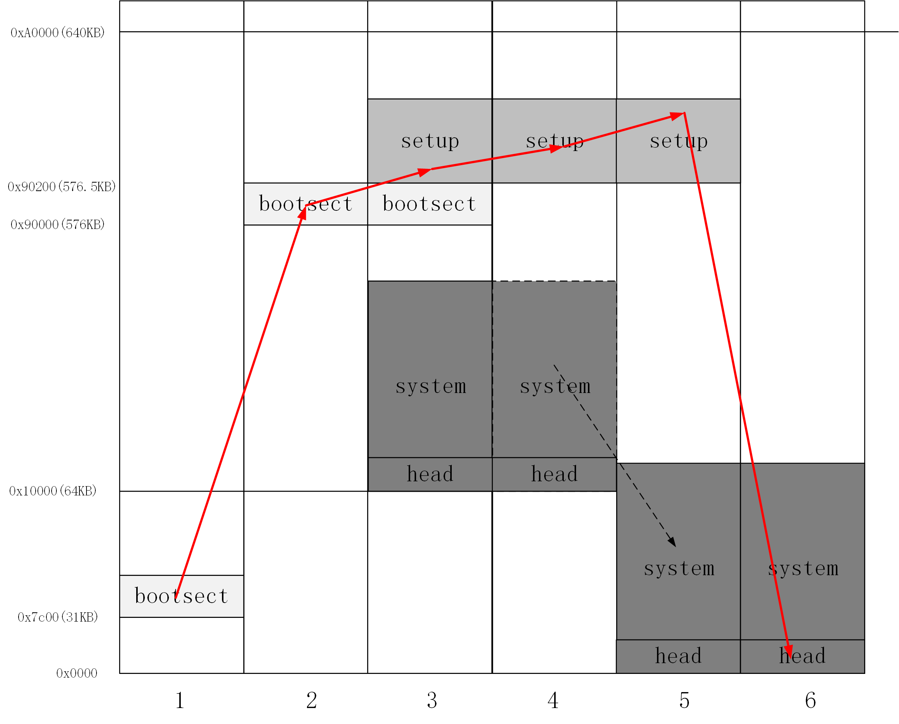

# Linux0.12的启动过程

## 一、BIOS
&emsp;x86 PC机刚开机时CPU处于实模式；开机时，CS=0XFFFF，IP=0x0000；寻址0xFFFF0(ROM BIOS映射区)。BIOS是"Basic Input Output System"的缩写，即"基本输入输出系统"。BIOS会先运行**POST自检程序**(Power On Self Test，上电自检)，检查计算机的各种硬件。如果硬件出现问题，将给出各种提示信息，例如蜂鸣。并会在内存的物理地址0处开始**初始化中断向量**。

&emsp;自检完成后，将按照启动顺序去搜寻启动驱动器(计算机会读取该设备的第一个扇区，即最前面的512个字节。如果最后两个字节是`0x55`和`0xAA`，即为引导记录；如果不是，搜寻启动顺序中的下一个设备)，将引导记录读入到内存绝对地址`0x7c00`处，然后将系统控制权交给引导记录(bootsect)，由引导记录完成系统的启动。

## 二、引导程序 bootsect

1. 初始状态，bootsect被BIOS启动子程序加载至内存绝对地址`0x7c00`处后；

2. bootsect将自己移到了地址`0x90000`处，并跳转至那里运行；

    （小动作：首先从内存0x0000:0x0078处复制原软驱参数表到0x9000:0xfef4处，然后修改表中的每磁道最大扇区数为18；让中断向量 0x1e 的值指向新表。然后利用这个BIOS中断去加载setup。）

3. bootsect然后使用BIOS中断(此时还不能使用自己的中断，还未设置)，将setup直接加载到自己的后面`0x90200`，并将system加载到地址`0x10000`处。

## 三、setup

4. 程序进入setup运行，首先setup会获取机器系统的参数(例如光标位置，扩展内存数等)，并把他们保存到`0x90000`处(覆盖掉了原先bootsect的内容)，并且会把system模块从`0x10000`~`0x8ffff`移动到`0x00000`处

5. 进入32位保护模式，跳转到system模块最前面的head中运行。

