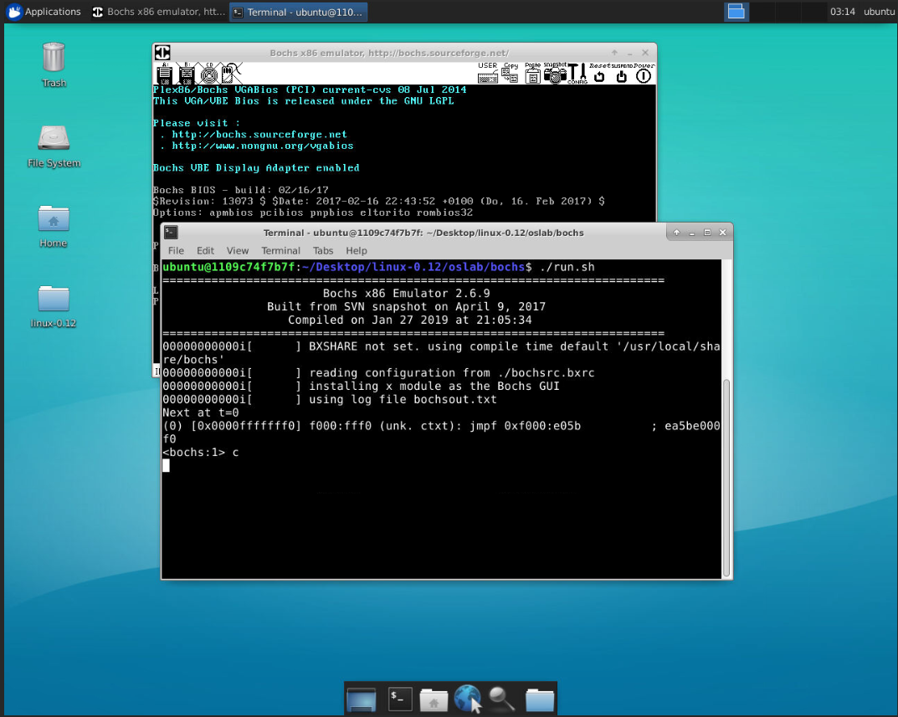

# linux-0.12 源码学习

*参考《Linux内核完全剖析 --基于0.12内核》*

加入中文注释，方便阅读，并**修改部分代码使其能在现在的环境下编译**。

| 文件夹        | 说明                  |
| ------------ | -------------------- |
| `linux-0.12` | linux-0.12源代码      |
| `oslab`      | 实验目录              |
| `.src`       | 一些资源和笔记         |

## 实验篇

### 一、环境搭建

#### ubuntu(64bit>=14.04)

ubuntu用户可以使用`.src/setup`目录下的一键搭建脚本[setup.sh](.src/setup/setup.sh)。

选项说明：

- 不带参数 &emsp;安装编译环境, 安装bochs虚拟机
- `-e` &emsp;安装编译环境(gcc-3.4,bin86等)
- `-b` &emsp;安装bochs模拟器
- `-bm` &emsp;下载和编译bochs源码, 生成bochs模拟器(一般用不到)

#### 其他系统(ubuntu也适用)

其他系统的用户可以选择已创建好的docker镜像作为实验环境(已安装gcc-3.4编译环境以及bochs模拟器)。docker安装过程不再描述，支持mac,windows,linux。

1. 首先从 docker hub 中拉取镜像;

    ```shell
    docker pull ultraji/ubuntu-xfce-novnc:os_learn 
    ```

2. 运行容器, 例如将本地项目目录C盘下 linux-0.12 挂载到 ubuntu用户的桌面下; 

    ```shell
    docker run -t -i -p 6080:6080 -v /c/linux-0.12:/home/ubuntu/Desktop/linux-0.12 ultraji/ubuntu-xfce-novnc:os_learn
    ```

3. 默认不启动VNC服务, 运行 home/ubuntu 目录下 vnc_startup.sh 脚本启动VNC服务。开启vncserver后就可以通过浏览器输入```http://localhost:6080/vnc.html```访问桌面系统了。

    - vnc登陆密码: 123456
    - 默认用户: ubuntu
    - 用户密码: 123456

    

## 笔记

1. [常见编译问题总结](.src/notes/make_problem.md) &emsp;如需对从 oldlinux 下载的 linux-0.1x 的代码进行修改, 可参考。

2. [源代码文件树](.src/notes/tree.md)

